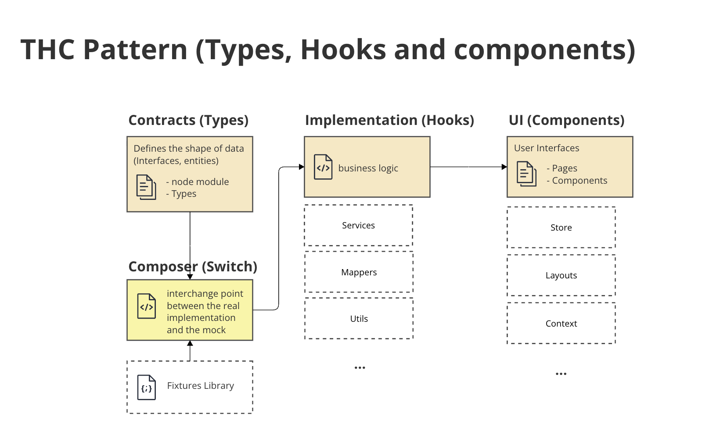
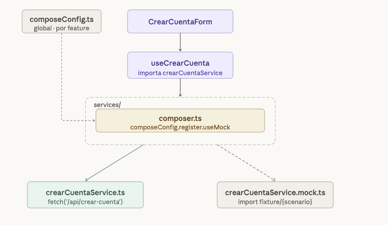
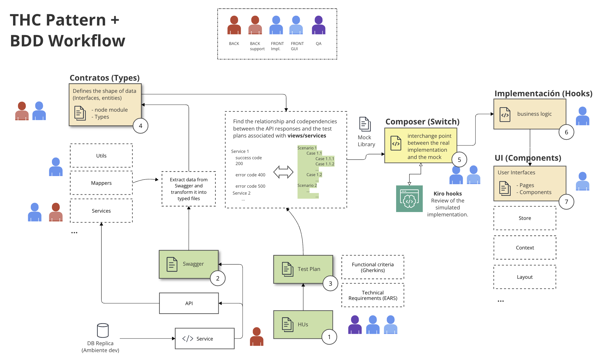

> También disponible en español: [README.es.md](./README.es.md)

# THC / THC-C Pattern

Based on the [JONA Pattern](https://github.com/Jofrantoba-Coding/patron-frontend-jona--) by Jonathan Franchesco Torres Baca.

> THC does not organize projects. It organizes features.

It doesn't replace your macro architecture. It lives inside it and organizes the small pieces: a form, a flow, a screen.

---

## Why does it exist?

When building a frontend feature you always need the same three things: a place for data, a place for logic, and a place for the UI. The problem is that without structure everything ends up mixed inside the component, and with too much structure nobody maintains it.

THC proposes the bare minimum: three layers named after the tools you already use.

The **THC-C** variant adds the Composer — an interchange point that lets the UI builder work against typed mocks while the implementor builds the real services. Both work in parallel without blocking each other.



---

## The layers

**THC** — the base. Always present.

| Layer | Responsibility |
|-------|---------------|
| Types | Data contracts. No logic, no calls, no rendering. |
| Hooks | Feature orchestrator. State, validations, service calls. |
| Components | Renders and captures interactions. No business logic. |

**THC-C** — adds the Composer when the UI builder needs to work without depending on the backend.

| Layer | Responsibility |
|-------|---------------|
| Composer | Interchange point between the real implementation and the mock. |
| Fixtures | Typed data by scenario. One folder per Test Plan case. |



---

## Gradual scaling

The pattern starts simple and grows only when needed.

| Level | What it adds | Reference folder |
|-------|-------------|-----------------|
| 1 | Basic THC — 3 files | [`src/features/nivel1/`](src/features/nivel1/README.md) |
| 2 | Composer + one scenario | [`src/features/nivel2/`](src/features/nivel2/README.md) |
| 3 | Multiple scenarios | [`src/features/nivel3/`](src/features/nivel3/README.md) |
| 4 | Service layer + global `composeConfig` | [`src/features/nivel4/`](src/features/nivel4/README.md) |
| 5 | Store, validators, mappers, multiple endpoints | [`src/features/crearCuenta/`](src/features/crearCuenta/README.md) |

---

## Start here

First time with the pattern → [`src/features/nivel1/`](src/features/nivel1/README.md)

Want to understand the Composer → [`src/features/nivel2/`](src/features/nivel2/README.md)

Want to see the full flow with BDD and multiple scenarios → [`src/features/crearCuenta/`](src/features/crearCuenta/README.md)

Want to understand centralized control → [`src/config/`](src/config/README.md)

---

## Repo structure

```
src/
├── config/          ← global composeConfig (THC-C variant B)
└── features/
    ├── nivel1/      ← basic THC
    ├── nivel2/      ← THC-C variant A, one scenario
    ├── nivel3/      ← THC-C variant A, multiple scenarios
    ├── nivel4/      ← THC-C variant B with services
    └── crearCuenta/ ← full THC-C (level 5)
```

Each folder has its own README with the detail of what lives there.

---

## THC-C with BDD

Fixtures are the direct translation of QA's acceptance criteria. Each Test Plan leaf case has its folder. Once fixtures are ready, the UI builder and the implementor work in parallel without blocking each other.



See the full flow at [`src/features/crearCuenta/fixtures/`](src/features/crearCuenta/fixtures/README.md).

---

Origin: evolution of the [JONA Pattern](https://github.com/Jofrantoba-Coding/patron-frontend-jona--) specialized for the modern reactive library ecosystem — React, Vue, Alpine.
